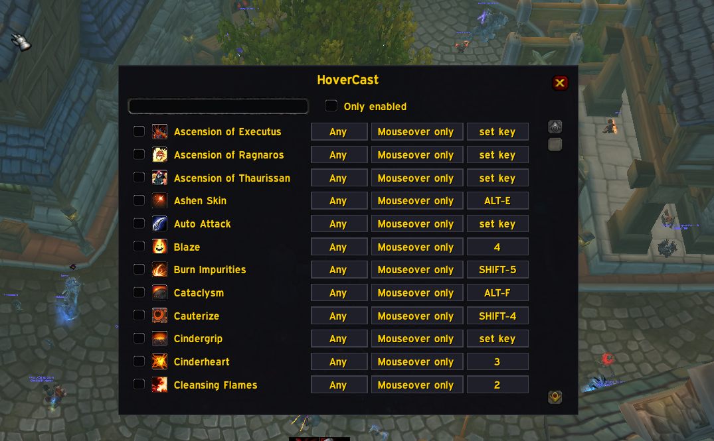

# HoverCast

**Mouseover casting for Project Ascension (WoW 3.3.5a) — without writing a single macro.**
Built by **WoloUI**.

Mouseover healing is the single biggest upgrade a healer can make, and on 3.3.5 the price
of admission is writing `#showtooltip / /cast [@mouseover,help][@target,help] Spell` into a
macro, dragging it onto a bar, rebinding the key, and then redoing all of it every time you
learn a new spell or respec.

HoverCast deletes that whole workflow. Tick a checkbox next to a spell and the key you
*already* have it bound to becomes a mouseover cast. Your action bars don't change. Your
keybinds don't change. No macros, no macro slots consumed.

Your whole spellbook, one row per spell: a checkbox to enable it, the target filter, the
fallback, and the key it resolved to — `set key` means the spell isn't on any action bar
yet, so click it and press one.

---

## How it works

HoverCast reads which key your spell is already bound to, then installs a **secure override
binding** on that key pointing at a hidden `SecureActionButton` carrying the mouseover
macrotext. When you release the key, the override is gone and your original binding is
untouched — nothing is permanently rewritten, and no macro slot is used.

Because it's driven by secure buttons and override bindings, it is a legitimate,
Blizzard-sanctioned mechanism — the same one Clique and healbot-style addons use.

---

## Features

- **Your whole spellbook, listed.** Every learned, non-passive spell across every tab,
  sorted, deduplicated, with icons. Nothing is class-assumed — Ascension is classless, so
  the scan is purely "what do you actually know".
- **Search box + "Only enabled" filter** so you can find a spell in a 200-spell classless
  spellbook, and then review just what you've turned on.
- **Per-spell target filter** — cycle **Friendly** / **Hostile** / **Any**. Friendly stops
  your heals firing at an enemy under your cursor; hostile stops your nukes wasting on a
  teammate.
- **Per-spell fallback chain** — what happens when nothing is under your cursor:
  - **Mouseover only** — do nothing (strict; never wastes a cast on the wrong unit)
  - **Target** — fall back to your current target
  - **Target+Self** — fall back to your target, then to yourself
- **Automatic key detection.** Scans all 120 action slots across the main bar and the four
  multi-action bars, and falls back to scanning **ElvUI's** bars via their
  `CLICK <button>:LeftButton` bindings.
- **Manual key override.** Click the key button, press any key, done. Right-click clears it
  and returns to auto-detection. Useful for spells that live on no bar at all.
- **Conflict warning.** If two enabled spells resolve to the same key, HoverCast tells you
  in chat which spell won instead of failing silently.
- **Combat safe.** Bindings are never rewritten mid-combat (the client forbids it).
  Changes you make while fighting are queued and applied the instant you drop combat.
- **Reacts to your changes.** Re-resolves automatically when you rebind keys, move spells
  between action slots, learn a spell, or change spec.
- **Per-character settings.** Your Rejuvenation setup on your healer doesn't follow your
  melee alt.
- **Draggable minimap button**, and ElvUI skinning applied automatically when ElvUI is
  present.

---

## Installation

1. Extract the `HoverCast` folder into `Interface/AddOns/`.
2. Restart the game client (3.3.5 only reads the `.toc` at startup).
3. Type `/hc`, tick the spells you want, and pick a filter and fallback for each.

Optional: ElvUI (bar scanning + window skinning).

## Commands

| Command | Does |
|---|---|
| `/hc` or `/hovercast` | Open/close the configuration window |
| `/hc dump` | Print every enabled spell with its resolved key and the exact macrotext produced — the fastest way to see why a spell isn't firing |

## Recommended starting point

| Spell type | Filter | Fallback |
|---|---|---|
| Direct heals, HoTs, dispels | Friendly | Target+Self |
| Damage spells and debuffs | Hostile | Target |
| Anything you must never misfire (big cooldowns, resurrect) | Friendly | Mouseover only |

## Support

This addon is free, and it stays free.

If it saved you from writing one more mouseover macro — or made your healing click into
place — you can buy me a coffee at **[ko-fi.com/woloui](https://ko-fi.com/woloui)**.
Completely optional and genuinely appreciated. ☕

Either way, thanks for playing with it. Bug reports and ideas are worth just as much.

## Credits

Made by **WoloUI**. Previously released under the working name *MouseoverMaster*.
